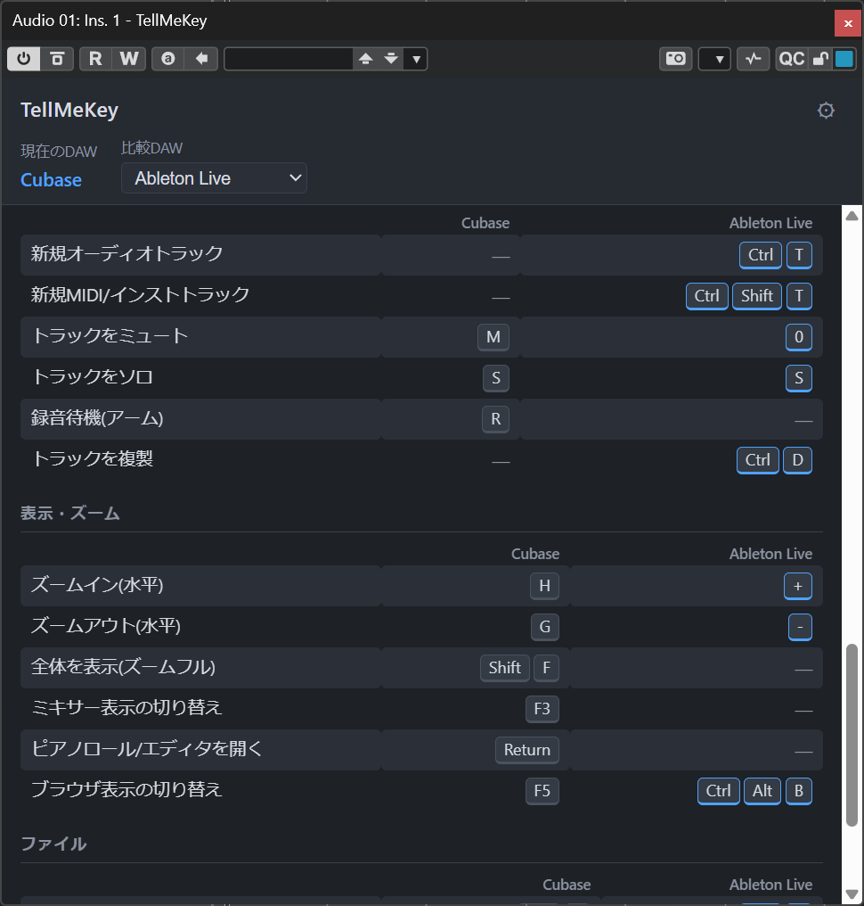

# TellMeKey

トラックにインサートするだけで、**いま使っているDAWの主要操作のショートカットキー一覧**を表示するVSTプラグインです。他のDAWに慣れている人向けに、**比較DAWのショートカットを併記表示**できます。

- 実行中のDAWを自動判別(Cubase / Ableton Live / FL Studio / Fender Studio Pro / Logic Pro / Pro Tools / REAPER / Bitwig Studio)。旧名称のStudio OneもFender Studio Proとして判別
- 約47個の主要操作(トランスポート/カーソル移動/編集/トラック/表示/ファイル)のショートカットを一覧表示
- 「比較DAW」を選ぶと、そのDAWでの同じ操作のキーを並べて表示
- 操作・キー・表示ラベルはJSONで定義。**JSONを差し替えることで日本語/英語表示の切り替えや内容のカスタマイズが可能**
- 判別できないホストでは「不明なDAW」と表示し、ショートカットは表示しません
- macビルドでは表示時に `Ctrl`→`Cmd`、`Alt`→`Opt` へ自動で読み替えます(JSONはWindows表記のままで両OSに対応。`Cmd`/`Opt`と明記されたキーはそのまま表示)
- 音声は完全パススルー(音に影響しません)




## ビルド

必要環境: CMake 3.22+ / Visual Studio 2022 (Windows) / Xcode (macOS)

```powershell
cmake -S . -B build -G "Visual Studio 17 2022" -A x64
cmake --build build --config Release --target TellMeKey_VST3
```

- JUCE 9.0.0 はFetchContentで自動取得されます。事前cloneがある場合は `-DFETCHCONTENT_SOURCE_DIR_JUCE=<path>` で指定できます。
- Windowsビルドには WebView2 SDK(NuGetパッケージ)が必要です。`external/webview2/` に `Microsoft.Web.WebView2.*` パッケージを展開して置くか、`-DJUCE_WEBVIEW2_PACKAGE_LOCATION=<dir>` で場所を指定してください。取得例:
  ```
  curl -L -o webview2.zip https://www.nuget.org/api/v2/package/Microsoft.Web.WebView2/1.0.1901.177
  unzip webview2.zip -d external/webview2/Microsoft.Web.WebView2.1.0.1901.177
  ```
- macOSでは `FORMATS AU VST3` により AU / VST3 の両方がビルドされます。

成果物: `build/TellMeKey_artefacts/Release/VST3/TellMeKey.vst3`

## JSONのカスタマイズ

デフォルト定義はプラグインに同梱されています(`assets/keymap.json` と同内容)。

1. `assets/keymap.json` をコピーして編集する(ラベルを英語にする、キーを自分の設定に合わせる、DAWを追加する等)
2. プラグインUIの ⚙(設定)→「JSONファイルを指定…」で編集したファイルを選ぶ
3. 以後はそのファイルが優先して読み込まれる(全DAW・全インスタンス共通)。「デフォルトに戻す」で解除

JSONの構造:

```jsonc
{
  "version": 1,
  "language": "ja",
  "daws": {                       // DAW id → 表示名。idは自動判別と対応する固定キー
    "cubase": { "displayName": "Cubase" }
  },
  "categories": [                 // 表示グループ
    { "id": "transport", "label": "トランスポート" }
  ],
  "operations": [                 // 主要操作
    {
      "id": "play_stop",
      "category": "transport",
      "label": "再生 / 停止",     // ここを書き換えれば表示言語を変えられる
      "shortcuts": {              // DAW idごとのキー。無いDAWは「—」表示
        "cubase": "Space"
      }
    }
  ]
}
```

自動判別に使うDAW id(固定): `cubase` `ableton_live` `fl_studio` `fender_studio_pro` `logic` `pro_tools` `reaper` `bitwig`

編集したJSONはUIの「再読み込み」ボタンで即時反映されます(DAWの再起動不要)。

### 新しいDAWを追加する(例: Digital Performer)

新しいDAWの追加には、**JSONの編集**に加えて**`src/HostDetector.h`の修正と再ビルド**が必要です(JSONだけでも比較DAWのドロップダウンには現れますが、そのDAW上で起動しても「不明なDAW」になってしまい実用になりません)。

1. JSONの `daws` に任意のidで1行追加する(デフォルトを変える場合は `assets/keymap.json`、カスタムJSON運用中はそのファイル):
   ```jsonc
   "daws": {
     "cubase": { "displayName": "Cubase" },
     // ...既存のDAW...
     "digital_performer": { "displayName": "Digital Performer" }
   }
   ```
   idは英数字とアンダースコアの任意の文字列でかまいません(既存idと重複しないこと)
2. 各操作の `shortcuts` に、同じidでキーを追記する:
   ```jsonc
   {
     "id": "play_stop",
     "category": "transport",
     "label": "再生 / 停止",
     "shortcuts": {
       "cubase": "Space",
       "digital_performer": "Space"
     }
   }
   ```
   書かなかった操作は「—」と表示されるので、全操作を埋める必要はありません
3. `src/HostDetector.h` の `detectDawId()` に判定を1行追加する。返す文字列は手順1のJSONのidと一致させること:
   ```cpp
   if (host.isDigitalPerformer())              return "digital_performer";
   ```
   使える判定メソッドはJUCEの `juce::PluginHostType`(`juce_PluginHostType.h`)を参照。`isDigitalPerformer()` `isArdour()` `isRenoise()` など多数のDAWに対応している
4. 再ビルドする:
   ```powershell
   cmake --build build --config Release --target TellMeKey_VST3
   ```
   デフォルトJSON(`assets/keymap.json`)を編集した場合はビルド時に埋め込み直される。カスタムJSONの場合はUIの「再読み込み」で反映

これで追加したDAW上での自動判別と、比較DAWとしての併記表示の両方が使えるようになります。

> JUCEの `PluginHostType` に判定メソッドがないDAWは自動判別できません(比較DAWとしてのみ追加可能)。

> **注意**: 同梱のショートカットデータは各DAWの標準キーバインドをもとにした参考値です。DAWのバージョンやキーマッププリセットによって異なる場合があります。実際の環境に合わせてJSONを修正してください。

## 構成

```
assets/keymap.json   デフォルトのショートカット定義(ビルド時に埋め込み)
assets/web/          WebView UI (HTML/CSS/JS)
src/                 JUCEプラグイン本体
  PluginProcessor    音声パススルーと状態(比較DAW・ウィンドウサイズ)の保存
  PluginEditor       WebViewの構築とネイティブ関数(JS⇔C++)
  HostDetector       PluginHostTypeによるDAW自動判別
  Settings           カスタムJSONパスのグローバル設定 (%APPDATA%/TellMeKey/)
  KeymapStore        JSON読み込み(カスタム優先→同梱デフォルトへフォールバック)
```
